# FlowLink — Complete Architecture Analysis

## Overview

FlowLink is a **hierarchical problem management and communication platform** built with HTML5, CSS3, Vanilla JavaScript, and Firebase (Auth + Firestore). It enables organizations to create nested structures, manage problems via vote-based priority, and moderate announcements — all governed by a role-based approval system.

---

## Tech Stack

| Layer | Technology |
|-------|-----------|
| Frontend | HTML5, CSS3, Vanilla JS (no framework) |
| Auth | Firebase Authentication (Email/Password + Google) |
| Database | Cloud Firestore |
| Hosting | Local (`http-server`) |
| Icons | Font Awesome 6.4, Lucide Icons |
| Fonts | Poppins, PT Sans (Google Fonts) |

---

## Project File Map

| File | Purpose | Lines |
|------|---------|-------|
| `firebase-config.js` | Firebase init + exports | ~46 |
| `auth.js` | `AuthService` class (sign-in/up/out) | ~161 |
| `login-handler.js` | Login page UI + form logic | ~380 |
| `dashboard-handler.js` | Dashboard UI interactions | ~196 |
| `global.js` | Shared utilities + page-specific JS/CSS | ~2475 |
| `welcome.html` | Hierarchy builder + Firebase CRUD | ~2338 |
| `dashboard.html` | Main dashboard + inline Firebase | ~8699 |
| `super-admin.html` | Super Admin panel | ~1850 |
| `firestore.rules` | Security rules | ~475 |
| `FIREBASE_RULES.md` | Rules docs + data structures | ~676 |

---

## Data Model (Firestore Collections)

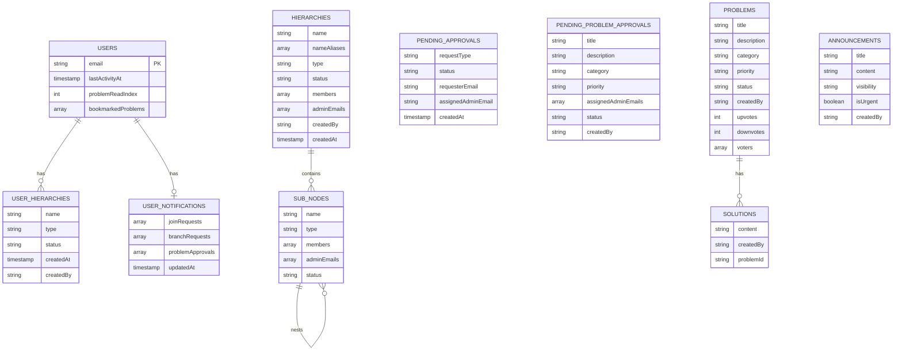

### Collection Paths

```
/users/{email}                                    ← User profile
/users/{email}/hierarchies/{orgId}                ← User's org copy
/users/{email}/hierarchies/{orgId}/sub-nodes/...  ← Nested nodes
/users/{email}/notifications/pending              ← Admin notifications

/hierarchies/{orgId}                              ← Global org (source of truth)
/hierarchies/{orgId}/sub-nodes/{nodeId}/...       ← Nested global nodes

/pendingApprovals/{id}                            ← Join/Branch/Org requests
/pendingProblemApprovals/{id}                     ← Problem submissions
/pendingAnnouncementApprovals/{id}                ← Announcement submissions

/problems/{id}                                    ← Active problems
/solvedProblems/{id}                              ← Solved problems
/archivedProblems/{id}                            ← Archived problems
/escalatedProblems/{id}                           ← Escalated problems
/solutions/{id}                                   ← Problem solutions
/announcements/{id}                               ← Active announcements
/superAdmin/{doc}                                 ← Super Admin tracking
```

---

## User Roles & Permissions

| Role | Who | Key Capabilities |
|------|-----|-----------------|
| **Super Admin** | `admin@flowlink.edu` | Approve/reject/merge orgs, assign org admins, full platform access |
| **Org Admin** | Assigned by Super Admin | Manage join/branch requests, sub-nodes, members, problems, announcements |
| **Node Admin** | Assigned by Org Admin | Manage their node's join/branch requests, direct children |
| **Regular User** | Any signed-in user | Create orgs, join nodes, report problems, vote, view announcements |

---

## Page Navigation Flow

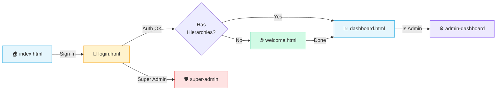

---

## Authentication Flow

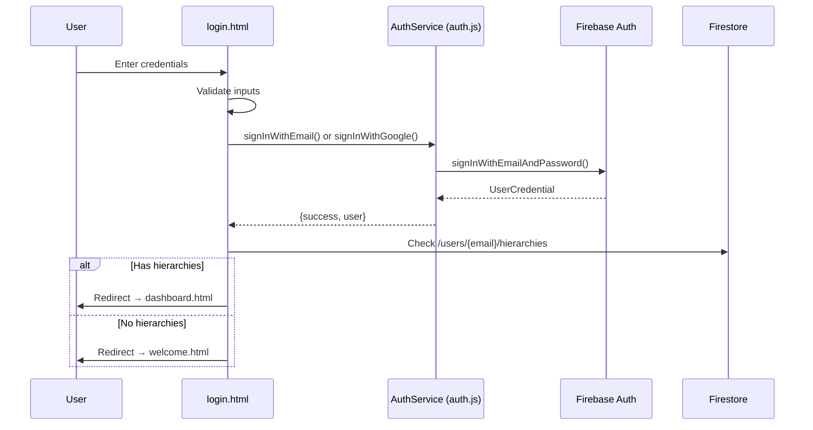

---

## Hierarchical Approval System

### Three Request Types

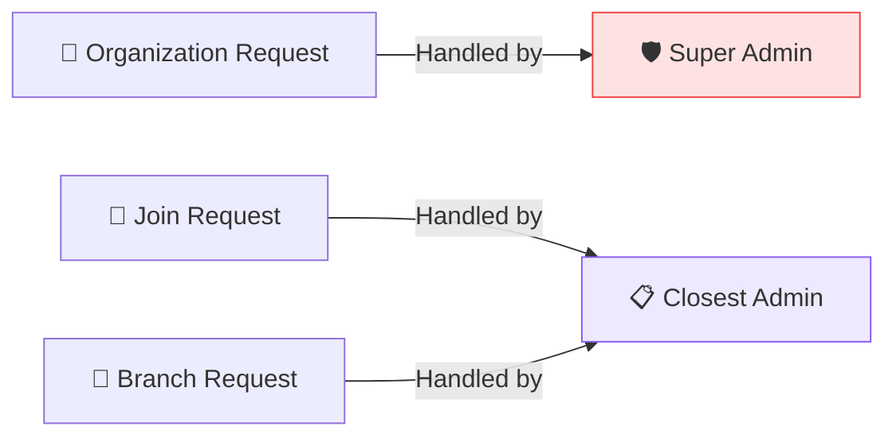

### Approval Chain — Finding the Right Admin

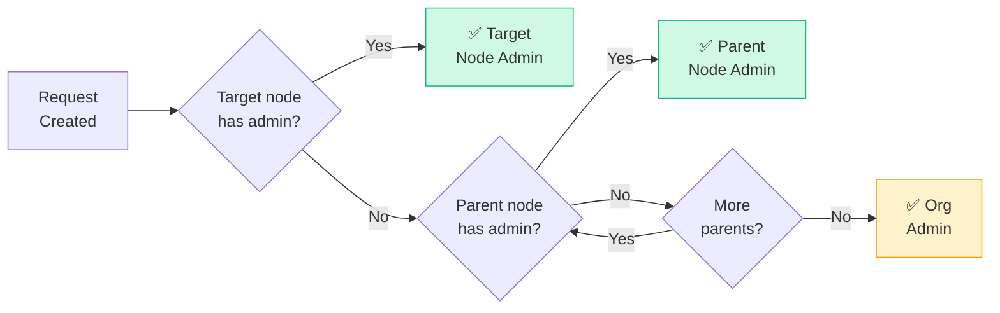

---

## 🔄 User Joining Channels — Detailed Flowchart

This is the complete step-by-step flow for a user joining an organization/channel, showing page navigation and data flow:

```mermaid
flowchart TD
    START["🧑 User lands on welcome.html<br/>(or dashboard.html My Network section)"] --> CHOICE{"Choose Action"}

    %% PATH 1: Browse & Join
    CHOICE -->|"Browse & Join"| BROWSE["Click 'Browse & Join' button"]
    BROWSE --> LOAD_ORGS["📡 Firestore: getDocs(/hierarchies)<br/>Load all active organizations"]
    LOAD_ORGS --> RENDER_LIST["Render org cards with:<br/>Name, Type, Member count, Sub-nodes"]
    RENDER_LIST --> SEARCH{"Search / Filter?"}
    SEARCH -->|"Yes"| FILTER["Filter by name/type<br/>(client-side)"]
    FILTER --> SELECT
    SEARCH -->|"No"| SELECT["User selects an organization"]

    SELECT --> HAS_ADMIN{"Org has an admin?"}
    HAS_ADMIN -->|"No"| BLOCKED["⚠️ 'No admin yet'<br/>Button disabled"]
    HAS_ADMIN -->|"Yes"| CHECK_MEMBER{"Already a member?"}
    CHECK_MEMBER -->|"Yes"| ALREADY["✅ Shows 'Joined' badge"]
    CHECK_MEMBER -->|"No"| CLICK_JOIN["Click 'Join' button"]

    CLICK_JOIN --> CHECK_EXISTING["📡 Check /users/{email}/hierarchies/{orgId}<br/>Already exists?"]
    CHECK_EXISTING -->|"Active"| ERR1["❌ 'Already a member'"]
    CHECK_EXISTING -->|"Pending"| ERR2["❌ 'Already pending'"]
    CHECK_EXISTING -->|"Draft"| ERR3["❌ 'Already in draft'"]
    CHECK_EXISTING -->|"Not found"| CONFIRM["Confirm dialog:<br/>'Add to your network?'"]

    CONFIRM -->|"Cancel"| RENDER_LIST
    CONFIRM -->|"OK"| CREATE_DRAFT

    %% PATH 2: Create New Org
    CHOICE -->|"Create New"| ADD_ORG["Click 'Add Organization'"]
    ADD_ORG --> MODAL["Open modal:<br/>Enter Name + Type"]
    MODAL --> SAVE_DRAFT["Save as DRAFT in user's hierarchy"]

    %% SHARED: Draft creation
    CREATE_DRAFT["📡 Firestore: setDoc<br/>/users/{email}/hierarchies/{orgId}<br/>status: 'draft', joinExisting: true"]
    SAVE_DRAFT --> DRAFT_NODE["📋 Node appears as 'Draft'<br/>in hierarchy view"]
    CREATE_DRAFT --> DRAFT_NODE

    %% ADD SUB-NODES (optional)
    DRAFT_NODE --> ADD_CHILD{"Add sub-nodes?"}
    ADD_CHILD -->|"Yes"| CHILD_MODAL["Open 'Add Sub-Node' modal<br/>Enter name + type"]
    CHILD_MODAL --> SAVE_CHILD["📡 setDoc: /users/{email}/hierarchies/{orgId}/sub-nodes/{nodeId}<br/>status: 'draft'"]
    SAVE_CHILD --> DRAFT_NODE
    ADD_CHILD -->|"No, ready"| DONE

    %% DONE BUTTON - Submit for approval
    DONE["Click 'Done' ✅"] --> FIND_DRAFTS["findDraftNodes():<br/>Collect all draft trees"]
    FIND_DRAFTS --> PROCESS{"For each draft tree"}

    PROCESS --> IS_JOIN{"joinExisting flag?"}
    IS_JOIN -->|"Yes (Browse & Join)"| FIND_LEAVES_J["Find deepest leaf nodes"]
    IS_JOIN -->|"No (New Org)"| IS_NEW_ORG{"Org exists globally?"}

    IS_NEW_ORG -->|"No"| CREATE_ORG_REQ["📡 setDoc: /pendingApprovals/{id}<br/>requestType: 'organization'<br/>status: 'pending'"]
    IS_NEW_ORG -->|"Yes"| FIND_LEAVES_B["Find divergence point"]

    FIND_LEAVES_J --> CREATE_JOIN_REQ
    FIND_LEAVES_B --> CREATE_BRANCH_REQ

    %% JOIN REQUEST
    CREATE_JOIN_REQ["📡 STEP 1: Find closest admin<br/>(findApproverForNode)"]
    CREATE_JOIN_REQ --> WRITE_JOIN["📡 STEP 2: setDoc: /pendingApprovals/{id}<br/>requestType: 'join'<br/>assignedAdminEmail: admin<br/>status: 'pending'"]
    WRITE_JOIN --> NOTIFY_ADMIN_J["📡 STEP 3: Update admin notifications<br/>/users/{admin}/notifications/pending<br/>joinRequests: arrayUnion(id)"]

    %% BRANCH REQUEST
    CREATE_BRANCH_REQ["📡 STEP 1: Find closest admin"]
    CREATE_BRANCH_REQ --> WRITE_BRANCH["📡 STEP 2: setDoc: /pendingApprovals/{id}<br/>requestType: 'branch'<br/>assignedAdminEmail: admin"]
    WRITE_BRANCH --> NOTIFY_ADMIN_B["📡 STEP 3: Update admin notifications<br/>branchRequests: arrayUnion(id)"]
    WRITE_BRANCH --> CREATE_PENDING_NODE["📡 STEP 4: Create pending node<br/>in user's hierarchy"]

    %% STATUS UPDATE
    NOTIFY_ADMIN_J --> UPDATE_STATUS
    NOTIFY_ADMIN_B --> UPDATE_STATUS
    CREATE_ORG_REQ --> UPDATE_STATUS
    CREATE_PENDING_NODE --> UPDATE_STATUS

    UPDATE_STATUS["📡 updateTreeStatus:<br/>All draft nodes → 'pending'"] --> REDIRECT["🔄 Redirect → dashboard.html"]

    %% ADMIN SIDE
    REDIRECT -.->|"Meanwhile..."| ADMIN_SEES["Admin sees notification<br/>in Admin Dashboard"]
    ADMIN_SEES --> ADMIN_ACTION{"Admin Action"}
    ADMIN_ACTION -->|"Approve"| APPROVE["📡 Add user to members[] in<br/>/hierarchies/{orgId}...<br/>Update user hierarchy status → 'active'"]
    ADMIN_ACTION -->|"Reject"| REJECT["📡 Update status → 'rejected'<br/>Notify user"]

    APPROVE --> ACTIVE["✅ User is now a MEMBER<br/>Node status: 'active'<br/>Visible in dashboard"]

    style START fill:#E5F6FD,stroke:#29ABE2
    style DONE fill:#D1FAE5,stroke:#10B981
    style ACTIVE fill:#D1FAE5,stroke:#10B981
    style BLOCKED fill:#FFF3CD,stroke:#F59E0B
    style ERR1 fill:#FEE2E2,stroke:#EF4444
    style ERR2 fill:#FEE2E2,stroke:#EF4444
    style ERR3 fill:#FEE2E2,stroke:#EF4444
    style REJECT fill:#FEE2E2,stroke:#EF4444
```

### Key Data Written During Join Flow

| Step | Firestore Path | Data |
|------|---------------|------|
| 1. Draft created | `/users/{email}/hierarchies/{orgId}` | `{name, type, status: "draft", joinExisting: true}` |
| 2. "Done" clicked | `/pendingApprovals/{join-timestamp}` | `{requestType: "join", requesterEmail, targetNodePath, assignedAdminEmail, status: "pending"}` |
| 3. Admin notified | `/users/{admin}/notifications/pending` | `joinRequests: arrayUnion(approvalId)` |
| 4. Status updated | `/users/{email}/hierarchies/{orgId}` | `status: "pending"` |
| 5. Admin approves | `/hierarchies/{orgId}` | `members: arrayUnion(userEmail)` |
| 6. User updated | `/users/{email}/hierarchies/{orgId}` | `status: "active"` |

---

### Staged Breakdown

The user joining process has two entry paths that converge into a shared submission flow. The diagrams below break this into digestible stages.

### Stage 1 — Entry Point: Choose How to Join

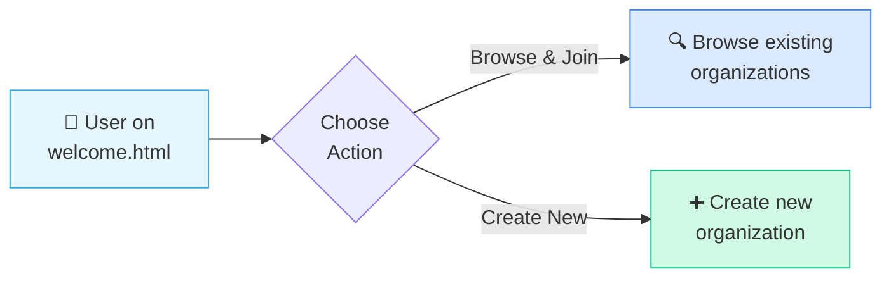

### Stage 2a — Browse & Join Path

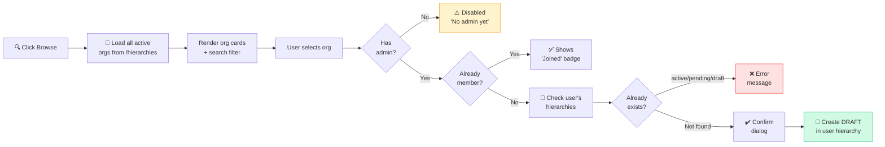

> **Firestore write:** `setDoc(/users/{email}/hierarchies/{orgId})` with `status: "draft"`, `joinExisting: true`

### Stage 2b — Create New Path

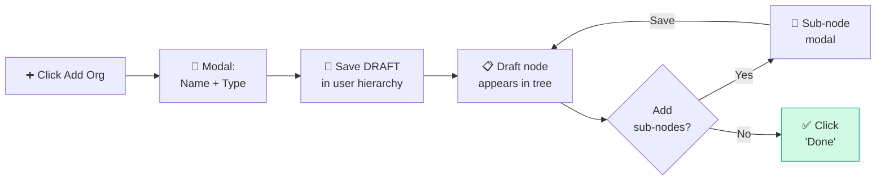

> **Firestore write:** `setDoc(/users/{email}/hierarchies/{orgId})` with `status: "draft"`

### Stage 3 — Submission: The "Done" Button

When the user clicks **Done**, all draft nodes are collected and submitted as approval requests:

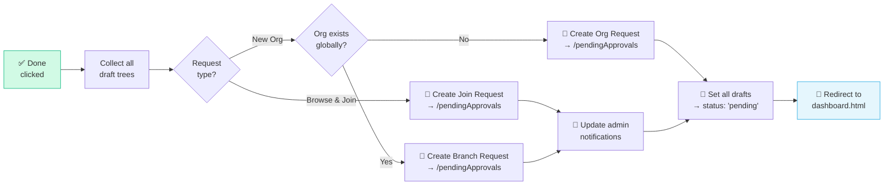

### Stage 4 — Admin Review & Resolution

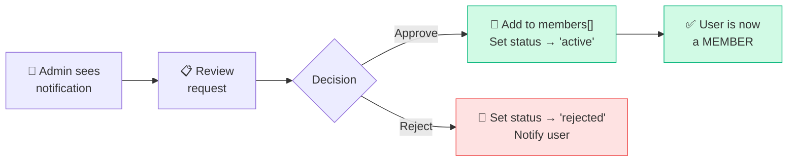

### Data Written At Each Stage

| Stage | Firestore Path | Key Data |
|-------|---------------|----------|
| Draft created | `/users/{email}/hierarchies/{orgId}` | `status: "draft"`, `joinExisting: true` |
| "Done" clicked | `/pendingApprovals/{join-timestamp}` | `requestType: "join"`, `assignedAdminEmail`, `status: "pending"` |
| Admin notified | `/users/{admin}/notifications/pending` | `joinRequests: arrayUnion(approvalId)` |
| Status updated | `/users/{email}/hierarchies/{orgId}` | `status: "pending"` |
| Admin approves | `/hierarchies/{orgId}` | `members: arrayUnion(userEmail)` |
| User activated | `/users/{email}/hierarchies/{orgId}` | `status: "active"` |

---

## Problem Governance Flow

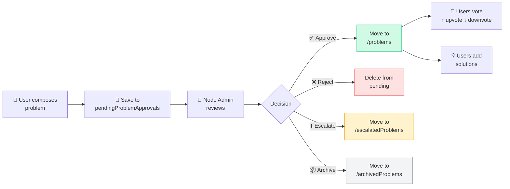

---

## Dual-Storage Architecture

A key architectural pattern is the **dual storage** of hierarchy data:

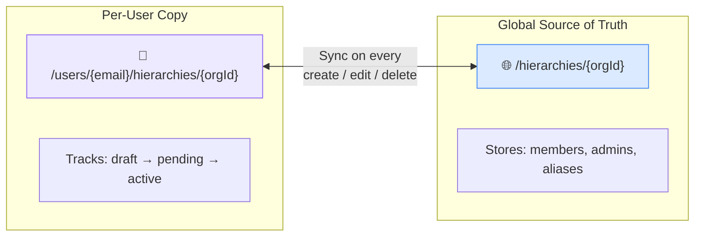

> **Important:** Every hierarchy change writes to **both** the user's personal collection and the global `/hierarchies` collection. The global copy is the source of truth for membership, while the user copy tracks personal status.

---

## Smart Branch-to-Join Conversion

When a user tries to create a sub-node that already exists globally, the system automatically converts the request:

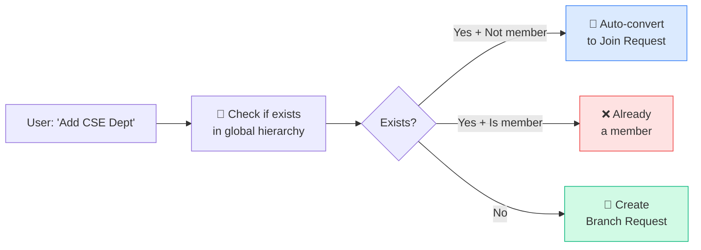

---

## Org Merge Feature (Super Admin)

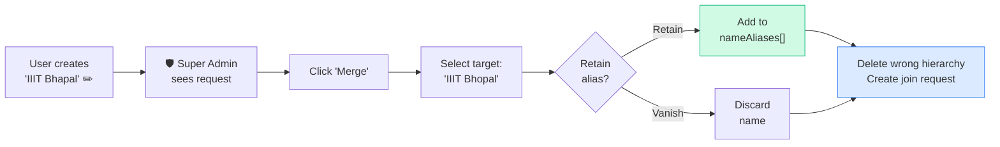

---

## Security Architecture

Access control is enforced at the Firestore level via security rules:

| Collection | Read | Write | Delete |
|-----------|------|-------|--------|
| `/users/{email}` | Owner only | Owner only | Owner only |
| `/hierarchies/{orgId}` | Any signed-in | Members / Admins | Org Admin / Super |
| `/pendingApprovals/{id}` | Super / Assigned / Requester | Signed-in (create) | Super / Assigned |
| `/problems/{id}` | Signed-in | Owner / Admin / Super | Owner / Super |
| `/superAdmin/**` | Super Admin only | Super Admin only | Super Admin only |

### Key Security Functions in `firestore.rules`

| Function | Check |
|----------|-------|
| `isSuperAdmin()` | `email == 'admin@flowlink.edu'` |
| `isOrgAdmin()` | `email in resource.data.adminEmails` |
| `isMember()` | `email in resource.data.members` |
| `isOwnerByEmail(email)` | `auth.token.email == email` |
